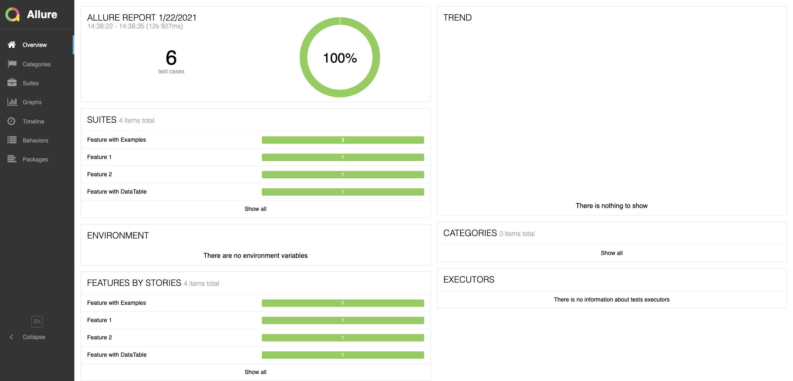

# Courgette-JVM with Allure Example

An example project showing how to use Courgette-JVM with Allure.

## System Requirements

* Allure
* Google Chrome
* MacOS / Windows / Linux

## Test Execution

* **Generate Allure Report using Courgette JUnit Runner**
    * Run tests
      * Option 1: Run `suites/junit/TestSuite.java` as a standard JUnit test
     
      * Option 2: Execute gradle task 
      ````gradle
       gradle runTestsUsingJUnit
      ````
  
    * Generate Allure test report from the project root
      ````
       allure generate --clean
      ````

  * Serve Allure test report from the project root
      ````
       allure serve
      ````
  
* **Generate Allure Report using Courgette TestNG Runner**
    * Option 1: Run `suites/testng/TestSuite.java` as a standard TestNG test
    
    * Option 2: Execute gradle task 
        ````gradle
         gradle runTestsUsingTestNG
        ````

    * Generate Allure test report from the project root
      ````
       allure generate --clean
      ````

    * Serve Allure test report from the project root
      ````
       allure serve
      ````
      
## Report

      
